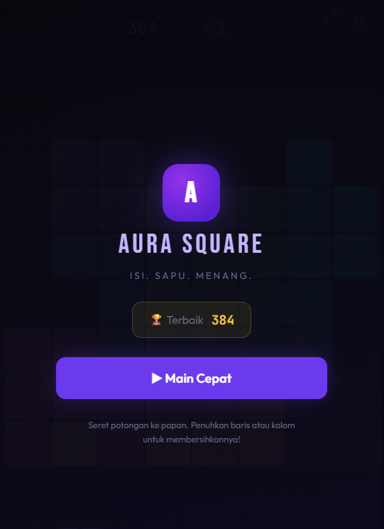
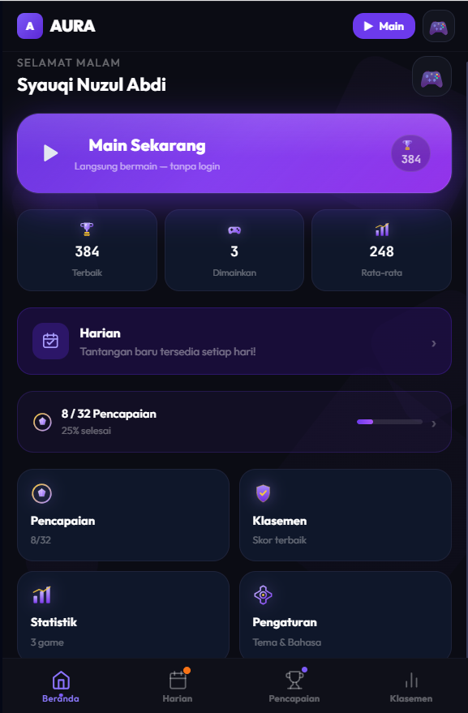
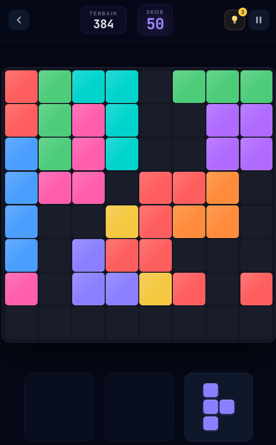
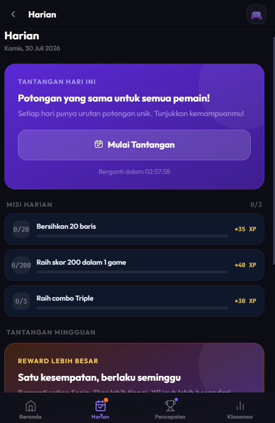
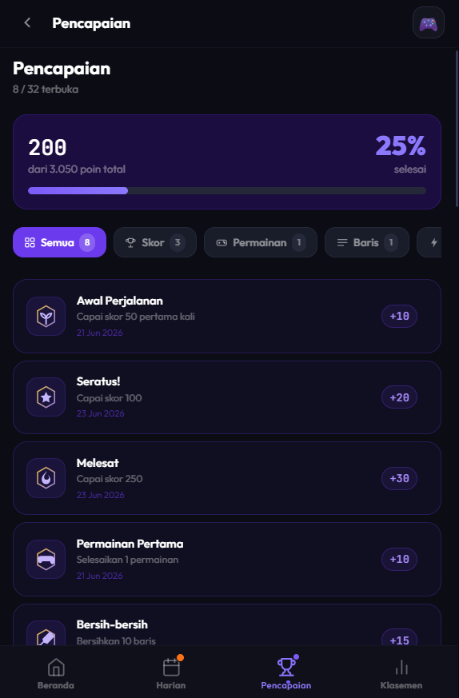
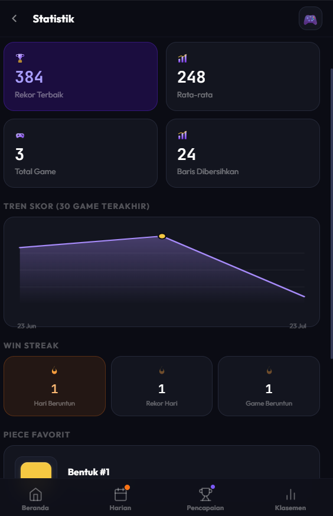
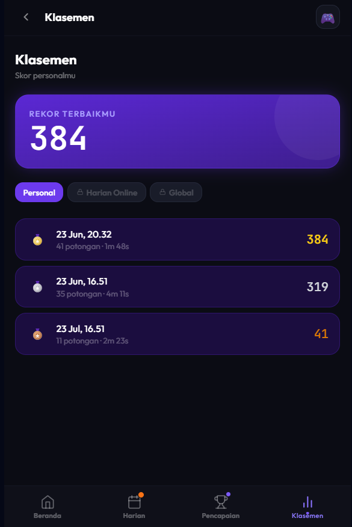
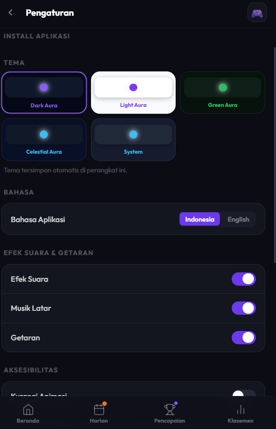

<div align="center">



# 🟣 Aura Square

### *"Isi. Sapu. Menang."*

**Owner:** Syauqi Nuzul Abdi | **Versi:** 3.0.0 | **Mode:** Zero Login · Offline-First · PWA

<br/>

[](https://typescriptlang.org)
[](https://reactjs.org)
[](/)
[](https://web.dev/pwa)
[](/)
[](/)
[](https://aura-square.vercel.app)
[-orange)](./LICENSE)

Game puzzle block premium — mainkan langsung di browser, tanpa akun, tanpa server. Semua progress tersimpan di perangkatmu sendiri.

<br/>

[Main Sekarang](https://aura-square.vercel.app) •
[Cuplikan Layar](#-cuplikan-layar) •
[Fitur](#-fitur-utama) •
[Instalasi](#-cara-jalankan) •
[Struktur](#-struktur-proyek) •
[Storage](#-data-storage-semua-lokal-tanpa-server) •
[Testing](#-testing--kualitas) •
[Native Build](#-membungkus-ke-native-capacitor)

</div>

---

## Cuplikan Layar

<div align="center">

<table>
<tr>
<td align="center" width="25%">
<br/>
<sub><b>Beranda</b></sub>
</td>
<td align="center" width="25%">
<br/>
<sub><b>Gameplay</b></sub>
</td>
<td align="center" width="25%">
<br/>
<sub><b>Tantangan Harian</b></sub>
</td>
<td align="center" width="25%">
<br/>
<sub><b>Pencapaian</b></sub>
</td>
</tr>
<tr>
<td align="center" width="25%">
<br/>
<sub><b>Statistik</b></sub>
</td>
<td align="center" width="25%">
<br/>
<sub><b>Klasemen</b></sub>
</td>
<td align="center" width="25%">
<br/>
<sub><b>Pengaturan</b></sub>
</td>
<td align="center" width="25%">
<br/>
<sub><b>Layar Mulai</b></sub>
</td>
</tr>
</table>

</div>

---

<br/>

## Tentang

Aura Square adalah game puzzle block 8×8 — drag & drop piece, sapu baris, kejar skor tertinggi. Dibangun sebagai Progressive Web App yang sepenuhnya *offline-first*: tanpa login, tanpa server wajib, semua progres tersimpan di perangkatmu sendiri.

🔗 **Coba sekarang:** [aura-square.vercel.app](https://aura-square.vercel.app)

<br/>

## Mulai

### 🌐 Main langsung (tanpa install)

Buka **[aura-square.vercel.app](https://aura-square.vercel.app)** — langsung main dari browser, bisa juga di-install sebagai PWA ke home screen HP/desktop kamu.

### Jalankan secara lokal

```bash
npm install
npm run dev
```

Buka `http://localhost:5173` dan langsung main.

```bash
npm run build     # build production + PWA
npm run test      # 114 unit test
npm run ci        # typecheck + lint + test
```

<br/>

## Fitur

- 🎮 **Board 8×8** dengan drag-and-drop, combo, particle effect, dan hint gratis
- 🗓️ **Tantangan Harian & Mingguan**, 32 achievement, level & rank system
- 📊 **Statistik lengkap** — grafik skor, streak, riwayat 50 game terakhir
- 🎨 **5 tema visual**, avatar, dukungan Bahasa Indonesia & English
- 📱 **PWA installable**, jalan penuh offline, backup/restore progres ke JSON
- 🎵 **Audio tersintesis** — efek suara & musik ambient tanpa file eksternal

<br/>

## Struktur Singkat

```
src/
├── engine/      → logika game murni (114 test)
├── store/       → 8 Zustand store, persisted ke localStorage
├── services/    → audio, backup, share card, firestore (opsional)
├── hooks/       → drag-drop, achievement, PWA update, dsb.
├── pages/       → Home, Game, Daily, Achievements, Profile, dst.
└── i18n/        → id.json / en.json (428 key, 100% sinkron)
```

<br/>

## Data & Privasi

Semua progres tersimpan lokal di `localStorage` perangkatmu — tidak ada akun, tidak ada tracking. Ingin backup? Buka **Pengaturan → Data** untuk ekspor/impor progres sebagai file JSON.

Klasemen online bersifat opsional dan hanya aktif jika `.env.local` dikonfigurasi dengan Firebase project sendiri.

<br/>

## Deployment

Aura Square di-deploy sebagai **Progressive Web App (PWA)** melalui **Vercel**, dengan continuous deployment — setiap push ke branch `main` otomatis ter-deploy ulang.

- 🌐 **Live:** [aura-square.vercel.app](https://aura-square.vercel.app)
- ⚙️ **Platform:** Vercel
- 🔁 **CI/CD:** Auto-deploy dari GitHub (`main` branch)

<br/>

## Build ke Native

Project sudah siap dibungkus ke iOS/Android via Capacitor:

```bash
npm run build
npx cap add ios android
npm run cap:sync
npm run cap:open:ios      # atau cap:open:android
```

<br/>

## Lisensi

Project ini bersifat **source-available**, bukan open-source sepenuhnya. Kamu bebas **melihat dan mempelajari** kode-nya untuk referensi/edukasi. Namun, untuk **menggunakan, memodifikasi, atau mendistribusikan ulang** (termasuk untuk tujuan komersial), wajib mendapat **izin tertulis** dari pemilik terlebih dahulu.

 Selengkapnya: lihat file [`LICENSE`](./LICENSE)
 Untuk meminta izin, hubungi: [github.com/Jouqio](https://github.com/Jouqio)

<br/>

---

<div align="center">

Dibuat oleh **Syauqi Nuzul Abdi**
[](https://github.com/Jouqio)

<br/>

*Aura Square — Game puzzle block premium, installable, offline-first, tanpa login.*

**[Main Sekarang di aura-square.vercel.app](https://aura-square.vercel.app)**

</div>
